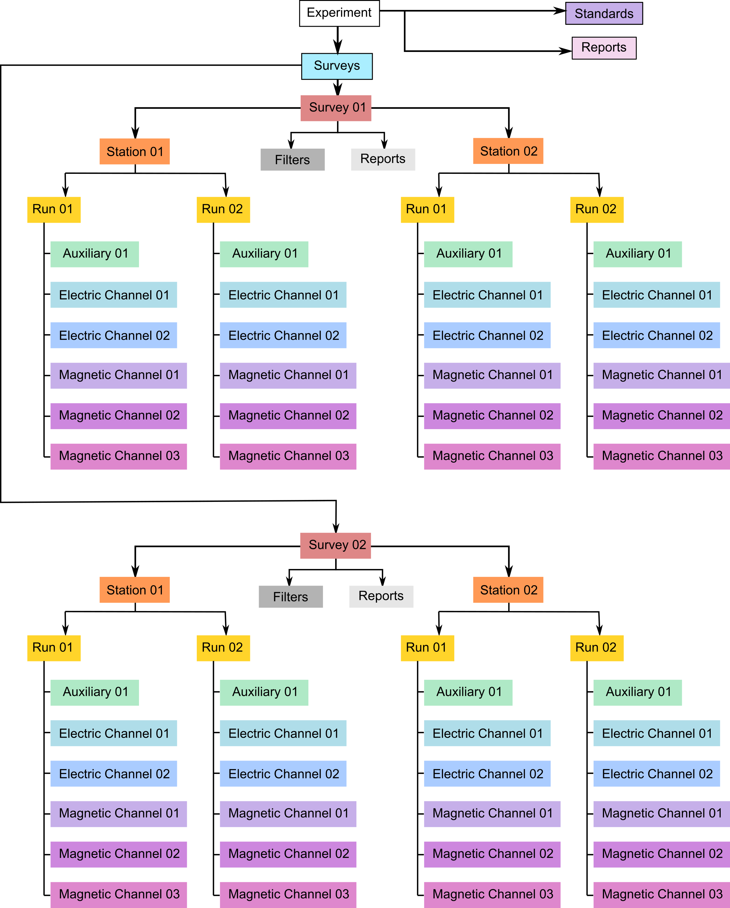
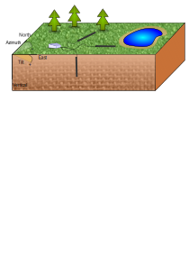

.. role:: red
.. role:: blue
.. role:: navy

====================================================
A Standard for Exchangeable Magnetotelluric Metadata
====================================================

:Author: Working Group for Data Handling and Software - PASSCAL Magnetotelluric Program
:Date:   **Version 0.0.16 – July 2020**\  [1]_

Introduction
============

Researchers using magnetotelluric (MT) methods lack a standardized
format for storing time series data and metadata. Commercially available
MT instruments produce data in formats that range from proprietary
binary to ASCII, whereas recent datasets from the U.S. MT community have
utilized institutional formats or heavily adapted formats like miniSEED.
In many cases, the available metadata for MT time series are incomplete
and loosely standardized; and overall, these datasets are not "user
friendly". This lack of a standardized resource impedes the exchange and
broader use of these data beyond a small community of specialists.

The `IRIS PASSCAL MT
facility <https://www.iris.edu/hq/programs/passcal/magnetotelluric_instrumentation>`__
maintains a pool of MT instruments that are freely available to U.S.
Principal Investigators (PIs). Datasets collected with these instruments
are subject to data sharing requirements, and an IRIS `working
group <https://www.iris.edu/hq/about_iris/governance/mt_soft>`__ advises
the development of sustainable data formats and workflows for this
facility. Following in the spirit of the standard created for `MT
transfer
function <https://library.seg.org/doi/10.1190/geo2018-0679.1>`__
datasets, this document outlines a new metadata standard for level
0,1,and 2 MT time series data (`Data
Levels <https://earthdata.nasa.gov/collaborate/open-data-services-and-software/data-information-policy/data-levels>`__).
Following community approval of these standards, MTH5 (an HDF5 MT
specific format) will be developed later in 2020.

The Python 3 module written for these standards and MTH5 is being
developed at https://github.com/kujaku11/MTarchive/tree/tables.

General Structure
=================

The metadata for a full MT dataset are structured to cover details from
single channel time series to a full survey. For simplicity, each of the
different scales of an MT survey and measurements have been categorized
starting from largest to smallest (Figure `1 <#fig:example>`__). These
categories are: ``Survey``, ``Station``, ``Run``, ``DataLogger``,
``Electric Channel``, ``Magnetic Channel``, and ``Auxiliary Channel``.
Each category is described in subsequent sections. Required keywords are
labeled as and suggested keywords are labeled as . A user should use as
much of the suggested metadata as possible for a full description of the
data.

   Schematic of a MT time series file structure with appropriate
   metadata. The top level is the *Survey* that contains general
   information about who, what, when, where, and how the data were
   collected. Underneath *Survey* are the *Station* and *Filter*.
   *Filter* contains information about different filters that need to be
   applied to the raw data to get appropriate units and calibrated
   measurements. Underneath *Station* are *Run*, which contain data that
   were collected at a single sampling rate with common start and end
   time at a single station. Finally, *Channel* describes each channel
   of data collected and can be an *Auxiliary*, *Electric*, or
   *Magnetic*. Metadata is attributed based on the type of data
   collected in the channel.

Metadata Keyword Format
-----------------------

The metadata key names should be self-explanatory and are structured
as follows:

    * ``{category}.{name}``, or can be nested
    * ``{category1}.{categroy2}.{name}`` where:
        -  ``category`` refers to a metadata category or level that has common
           parameters, such as ``location``, which will have a latitude,
           longitude, and elevation :math:`\longrightarrow`
           ``location.latitude``, ``location.longitude``, and
           ``location.elevation``. These can be nested, for example,
           ``station.location.latitude``

        -  ``name`` is a descriptive name, where words should be separated by an
           underscore. Note that only whole words should be used and
           abbreviations should be avoided, e.g. ``data_quality``.

A ‘.’ represents the separator between different categories. The
metadata can be stored in many different forms. Common forms are XML or
JSON formats. See examples below for various ways to represent the
metadata.

Formatting Standards
--------------------

Specific and required formatting standards for location, time and date,
and angles are defined below and should be adhered to.

Time and Date Format
~~~~~~~~~~~~~~~~~~~~

All time and dates are given as an ISO formatted date-time String in the
UTC time zone. The ISO Date Time format is
``YYYY-MM-DDThh:mm:ss.ms+00:00``, where the UTC time zone is represented
by ``+00:00``. UTC can also be denoted by ``Z`` at the end of the
date-time string ``YYYY-MM-DDThh:mm:ss.msZ``. Note that ``Z`` can also
represent Greenwich Mean Time (GMT) but is an acceptable representation
of UTC time. If the data requires a different time zone, this can be
accommodated but it is recommended that UTC be used whenever possible to
avoid confusion of local time and local daylight savings. Milliseconds
can be accurate to 9 decimal places. ISO dates are formatted
``YYYY-MM-DD``. Hours are given as a 24 hour number or military time,
e.g. 4:00 PM is 16:00.

Location
~~~~~~~~

All latitude and longitude locations are given in decimal degrees in the
well known datum specified at the ``Survey`` level. **NOTE: The entire
survey should use only one datum that is specified at the Survey
level.**

-  All latitude values must be :math:`<|90|` and all longitude values
   must be :math:`<|180|`.

-  Elevation and other distance values are given in meters.

-  Datum should be one of the well known datums, WGS84 is preferred, but
   others are acceptable.

Angles
~~~~~~

All angles of orientation are given in decimal degrees. Orientation of
channels should be given in a geographic or a geomagnetic reference
frame where the right-hand coordinates are assumed to be North = 0, East
= 90, and vertical is positive downward (Figure `2 <#fig:reference>`__).
The coordinate reference frame is given at the station level
``station.orientation.reference_frame``. Two angles to describe the
orientation of a sensor is given by ``channel.measurement_azimuth`` and
``channel.measurement_tilt``. In a geographic or geomagnetic reference
frame, the azimuth refers to the horizontal angle relative to north
positive clockwise, and the tilt refers to the vertical angle with
respect to the horizontal plane. In this reference frame, a tilt angle
of 90 points downward, 0 is parallel with the surface, and -90 points
upwards.

Archived data should remain in measurement coordinates. Any
transformation of coordinates for derived products can store the
transformation angles at the channel level in
``channel.transformed_azimuth`` and ``channel.transformed_tilt``, the
transformed reference frame can then be recorded in
``station.orientation.transformed_reference_frame``.

   Diagram showing a right-handed geographic coordinate system. The
   azimuth is measured positive clockwise along the horizontal axis and
   tilt is measured from the vertical axis with positive down = 0,
   positive up = 180, and horizontal = 90.

Units
-----

Acceptable units are only those from the International System of Units
(SI). Only long names in all lower case are acceptable. Table
`1 <#tab:units>`__ summarizes common acceptable units.

.. container::
   :name: tab:units

   .. table:: Acceptable Units

      ==================== ===============
      **Measurement Type** **Unit Name**
      ==================== ===============
      Angles               decimal degrees
      Distance             meter
      Electric Field       millivolt
      Latitude/Longitude   decimal degrees
      Magnetic Field       nanotesla
      Resistance           ohms
      Resistivity          ohm-meter
      Temperature          celsius
      Time                 second
      Voltage              volt
      ==================== ===============

String Formats
--------------

Each metadata keyword can have a specific string style, such as date and
time or alpha-numeric. These are described in Table `2 <#tab:values>`__.
Note that any list should be comma separated.

.. container::
   :name: tab:values

   .. table:: 
       :class: tight-table
       :widths: 30 45 15

      +----------------------+----------------------+----------------------+
      | **Style**            | **Description**      | **Example**          |
      +======================+======================+======================+
      | Free Form            | An unregulated       | This is Free Form!   |
      |                      | string that can      |                      |
      |                      | contain {a-z, A-Z,   |                      |
      |                      | 0-9} and special     |                      |
      |                      | characters           |                      |
      +----------------------+----------------------+----------------------+
      | Alpha Numeric        | A string that        | WGS84 or GEOMAG-USGS |
      |                      | contains no spaces   |                      |
      |                      | and only characters  |                      |
      |                      | {a-z, A-Z, 0-9, -,   |                      |
      |                      | /, \_}               |                      |
      +----------------------+----------------------+----------------------+
      | Controlled           | Only certain names   | reference_frame =    |
      | Vocabulary           | or words are         | geographic           |
      |                      | allowed. In this     |                      |
      |                      | case, examples of    |                      |
      |                      | acceptable values    |                      |
      |                      | are provided in the  |                      |
      |                      | documentation as [   |                      |
      |                      | option01 :math:`|`   |                      |
      |                      | option02 :math:`|`   |                      |
      |                      | ... ]. The ...       |                      |
      |                      | indicates that other |                      |
      |                      | options are possible |                      |
      |                      | but have not been    |                      |
      |                      | defined in the       |                      |
      |                      | standards yet        |                      |
      +----------------------+----------------------+----------------------+
      | List                 | List of entries      | Ex, Ey, Bx, By, Bz,  |
      |                      | using a comma        | T                    |
      |                      | separator            |                      |
      +----------------------+----------------------+----------------------+
      | Number               | A number according   | 10.0 (float) or 10   |
      |                      | to the data type;    | (integer)            |
      |                      | number of decimal    |                      |
      |                      | places has not been  |                      |
      |                      | implemented yet      |                      |
      +----------------------+----------------------+----------------------+
      | Date                 | ISO formatted date   | 2020-02-02           |
      |                      | YYYY-MM-DD in UTC    |                      |
      +----------------------+----------------------+----------------------+
      | Date Time            | ISO formatted date   | 2020-02-02T1         |
      |                      | time                 | 2:20:45.123456+00:00 |
      |                      | YYYY-MM-             |                      |
      |                      | DDThh:mm:ss.ms+00:00 |                      |
      |                      | in UTC               |                      |
      +----------------------+----------------------+----------------------+
      | Email                | A valid email        | `person@mt.or        |
      |                      | address              | g <person@mt.org>`__ |
      +----------------------+----------------------+----------------------+
      | URL                  | A full URL that a    | https://             |
      |                      | user can view in a   | www.passcal.nmt.edu/ |
      |                      | web browser          |                      |
      +----------------------+----------------------+----------------------+

Metadata Definitions
======================

.. toctree::
	:maxdepth: 3
	:caption: Time Series Metadata Standards

	ts_survey
	ts_station
	ts_run
	ts_auxiliary
	ts_electric
	ts_magnetic
	ts_filters

.. _appendix:

Option Definitions
==================

Electromagnetic Frequency Bands
--------------------------------
.. container::
   :name: em

   .. table:: Generalized electromagnetic period bands. Some overlap, use the closest definition.

      +---------------+------------------------------+---------------------------------+
      | **Data Type** | **Definition**               | **Frequency Range**             |
      +===============+==============================+=================================+
      | AMT           | radio magnetotellurics       | :math:`>10^{3}`                 |
      +---------------+------------------------------+---------------------------------+
      | BBMT          | broadband magnetotellurics   | :math:`10^{3}` – :math:`10^{0}` |
      +---------------+------------------------------+---------------------------------+
      | LPMT          | long-period magnetotellurics | :math:`<10^{0}`                 |
      +---------------+------------------------------+---------------------------------+

Channel Components
-------------------
.. container::
   :name: channel_types

   .. table:: These are the common channel components. More can be added.

      ================ ==========================
      **Channel Type** **Definition**
      ================ ==========================
      E                electric field measurement
      B                magnetic field measurement
      T                temperature
      Battery          battery
      SOH              state-of-health
      ================ ==========================

Directions
------------

.. container::
   :name: directions
	
   .. table:: The convention for many MT setups follows the right-hand-rule (Figure `2 <#fig:reference>`__) with X in the northern direction, Y in the eastern direction, and Z positive down. If the setup has multiple channels in the same direction, they can be labeled with a Number. For instance, if you measure multiple electric fields Ex01, Ey01, Ex02, Ey02.

      ============= ===================
      **Direction** **Definition**
      ============= ===================
      x             north direction
      y             east direction
      z             vertical direction
      # {0–9}       variable directions
      ============= ===================

.. [1]
   **Corresponding Authors:**

   Jared Peacock (`jpeacock@usgs.gov <jpeacock@usgs.gov>`__)

   Andy Frassetto
   (`andy.frassetto@iris.edu <andy.frassetto@iris.edu>`__)
